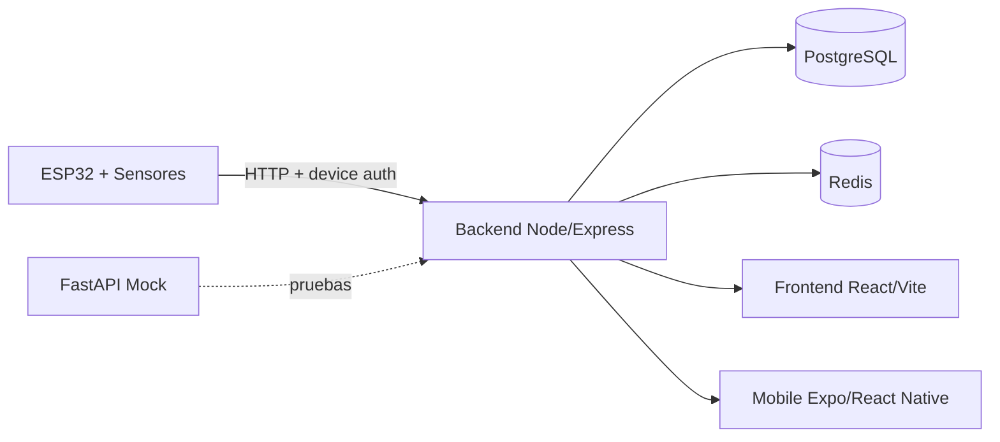

<p align="center">
  
</p>

<p align="center">
  
</p>

<h1 align="center">Sistema de Deteccion de Caidas</h1>

<p align="center">
  Plataforma full stack para monitoreo de eventos de caida, alertas y gestion de dispositivos.
  Incluye panel web, API, app movil y firmware IoT.
</p>

<p align="center">
  <a href="#stack">Stack</a> ·
  <a href="#modulos">Modulos</a> ·
  <a href="#arquitectura">Arquitectura</a> ·
  <a href="#quick-start">Quick Start</a> ·
  <a href="#base-de-datos">Base de datos</a>
</p>

<p align="center">
  
  
  
  
  
  
  
  
  
  
  
  
</p>

---

## Vision

Sistema orientado a deteccion temprana de caidas y eventos criticos con:

- Ingesta IoT (ESP32 + sensores) y correlacion de eventos.
- Dashboard web con estilo glassmorphism y analitica.
- App movil para usuarios finales y cuidadores.
- Chatbot con historial en Redis y contexto por rol.

## Stack

- Backend: Node.js, Express, TypeScript, PostgreSQL, JWT, Redis, Google OAuth.
- Frontend: React, Vite, TailwindCSS, Chart.js, jsPDF.
- Mobile: Expo + React Native, React Navigation, React Query.
- Hardware: ESP32 (firmware en Arduino), MPU6050 + sensores.
- Mock de hardware: FastAPI + Uvicorn.

## Modulos

- [backend/](backend/) API principal (auth, usuarios, dispositivos, eventos, chatbot).
- [fall-detection-frontend/](fall-detection-frontend/) panel web para administracion y visualizacion.
- [mobile/](mobile/) app movil (ADMIN y MEMBER).
- [hardware/](hardware/) firmware ESP32 y mock local.
- [backend/Base%20de%20Datos/](backend/Base%20de%20Datos/) scripts SQL y modelo relacional.

## Arquitectura



## Quick Start

1) Backend

```bash
cd backend
npm install
npm run dev
```

2) Frontend

```bash
cd fall-detection-frontend
npm install
npm run dev
```

3) Mobile

```bash
cd mobile
npm install
npm run start
```

4) Hardware (opcional)

- Ver [hardware/docs/README.md](hardware/docs/README.md)
- Firmware: [hardware/esp32/esp32_http.ino](hardware/esp32/esp32_http.ino)

## Variables de entorno (resumen)

Backend:

- `PORT`, `NODE_ENV`, `JWT_SECRET`
- `DB_HOST`, `DB_PORT`, `DB_DATABASE`, `DB_USER`, `DB_PASSWORD`
- `FRONTEND_URL`, `GOOGLE_CLIENT_ID`, `GOOGLE_CLIENT_SECRET`
- `REDIS_URL` (chatbot)

Frontend:

- `VITE_GOOGLE_CLIENT_ID` (opcional)

Mobile:

- `EXPO_PUBLIC_API_BASE_URL`
- `API_BASE_URL`
- `EXPO_PUBLIC_GOOGLE_*_CLIENT_ID`

## Base de datos

Script principal:

- [backend/Base%20de%20Datos/Scripts/create_db.sql](backend/Base%20de%20Datos/Scripts/create_db.sql)

Incluye tablas de usuarios, pacientes, dispositivos y eventos, mas vistas y triggers.

## Estilo visual

La UI sigue un look dark glassmorphism con gradientes indigo/cyan, sombras suaves y transiciones.
Esto replica el estilo de la app web y se refleja en este README con banners animados.

## Contribuir

- Issues y PRs bienvenidos.
- Mantener consistencia con TypeScript y estilo tailwind.

## Licencia

Pendiente.
